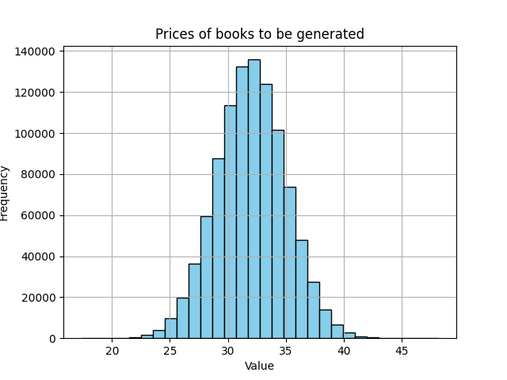

# 📘 EZ Librarian

**EZ Librarian** is a Minecraft mod that simplifies librarian enchanting. Instead of rerolling endlessly, players can place a written book into a lectern — and a nearby novice librarian will offer the enchantment named in the book.

---
📺 [Watch the full demo on YouTube](https://www.youtube.com/watch?v=YYp5JRZXx-4)

## ✨ Features

* 📖 **Insert a written book** into a **lectern** to trigger the enchantment.
* 🧠 The **first sentence** of the book must exactly match the name of a valid enchantment (e.g., `Mending`, `Fortune III`).
* 👨‍🏫 Works **only** on **novice librarians** (hasn’t been traded with).
* ⚡ Activates automatically when the book is placed — no need to break or replace anything.
* 🔒 **Locks** the trade after setting the enchantment to ensure a **balanced trading system** — no more infinite rerolling.
* ⏱ Saves time and effort by eliminating random rerolls.

---

## 🧠 Notes & Tips

* 🧙 Only one enchantment can be requested — the **first sentence only** is used(and lock the trade after).
* 👨‍🏫 The villager must be a **novice** with **no trades** made.
* 💬 Invalid or unrecognized enchantments will do nothing.
* 🔄 Once the enchantment is set, the trade is **permanently locked**, even if the lectern is broken or replaced.

---

## 😗 FAQ

**Q: Why didn't the librarian change trades?**
A: Check that the enchantment is valid, exactly spelled.

**Q: Can I use multiple sentences in the book?**
A: Yes, but only the **first sentence** is used.

**Q: Can I automate this with trading halls?**
A: Yes — as long as each station uses a lectern and written book properly.

**Q: Can I reroll the trade again after it's locked?**
A: No — once the enchantment is applied, the trade is **locked permanently** for balance.

## 📘 Price Generation Based on Statistical Distribution

Book prices are generated using a **normal (Gaussian) distribution** from a sample space of **1,000,000 simulations**.

- **Mean (μ)**: 32
- **Standard Deviation (σ)**: *σ* (configurable based on price variability)

This approach ensures that most prices are concentrated around **32 Emerald** , while higher or lower prices occur less frequently depending on the value of **σ**.

You can the prices spread based on the [Here](src/main/java/com/example/helper/BoxMuller.java) (if you don't want my pricing).

The distribution graph below visualizes the simulated price spread:

> The curve represents how prices naturally follow a bell-shaped pattern using the Box-Muller transform.

